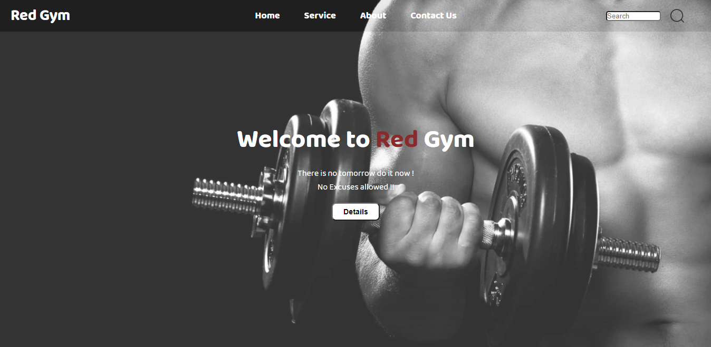
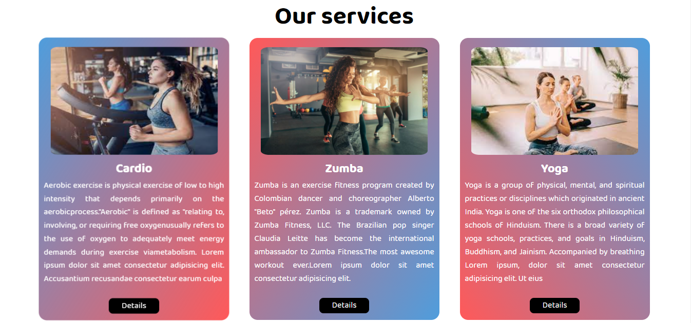
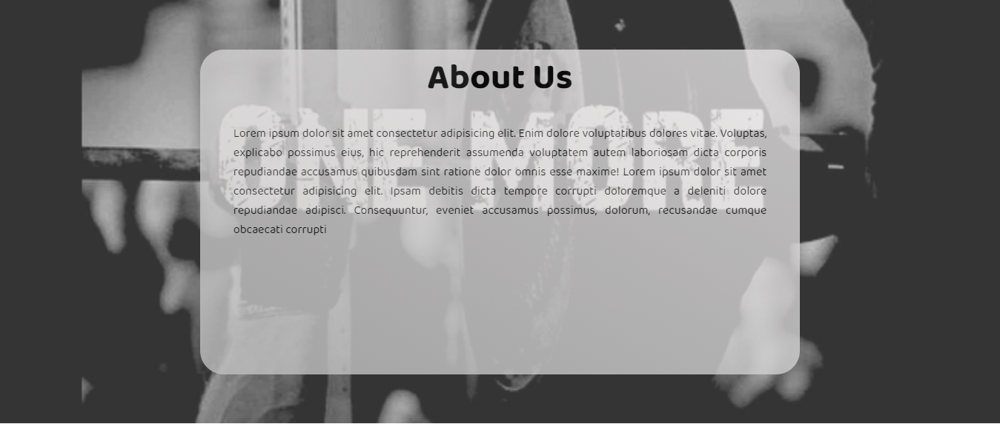
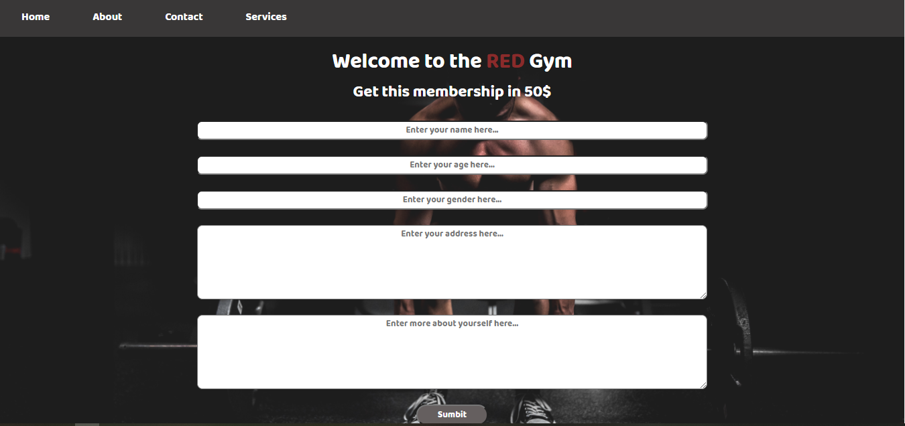

# Gym-Site
Fully fledged Website for Gym. 

### Home page


### Services Page

 
### About Page


### Contact Page


## Requirements
- Nodejs
- MongoDB

## Module Required (Dependencies)
- express
- mongoose
- pug
- body-parser

## How to install ?
commands:
``` npm install ``` or `npm i`
